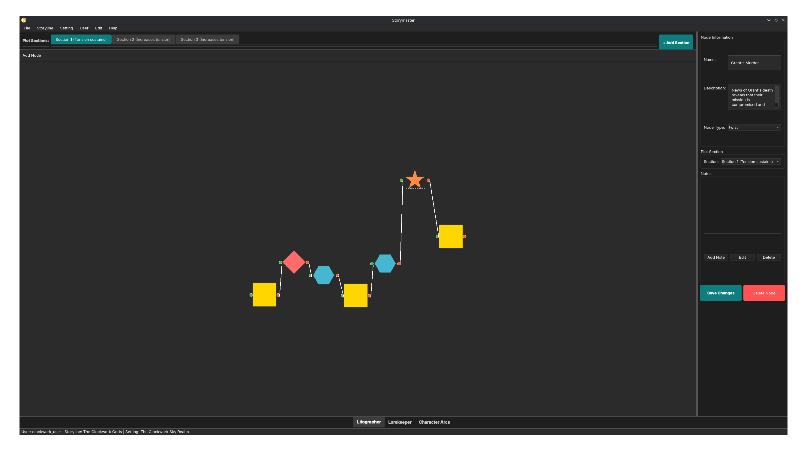
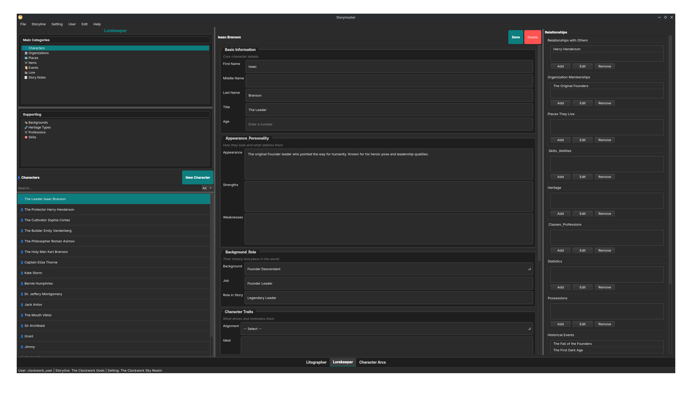
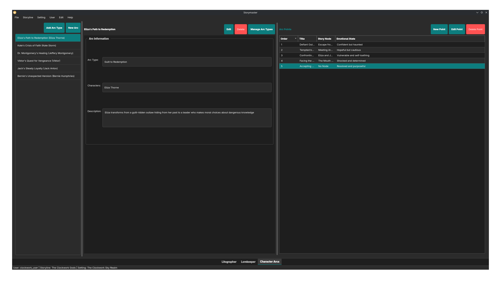

# STORYMASTER GETTING STARTED

### Download link:


[Download Link](https://github.com/Bohndiggin/storymaster/releases)

## Concepts

- _Setting:_ Settings are worlds. Multiple storylines can happen in one world. The Lore is attached to the setting so you can make a series of stories without rewriting all the lore.

- _Storyline:_ Storylines are the plots of your worlds. They are made up of Sections and Sections have Nodes.

### Litographer Concepts

- _Section:_ A section is a part of the storyline. It maps generally to Aristotle's plot structure. I.e. exposition is one section. You can also line them up with Acts if you want to go that route. Sections come in types such as:
  - Tension Sustains.
  - Tension Increases.
  - Singular Moment.
  - Tension Lowers.

```
     ^
    / \_
 __/   
```

- _Node:_ A node is a plot point. They can be of many types including:
  - Exposition
  - Action
  - Reaction
  - Twist
  - Development
  - Other

### Lorekeeper Concepts

- _Characters:_ Lorekeeper characters are well, characters.
  - Basic Information: Name, Title, Age
  - Appearance / Personality
  - Background / Role
    - Backgrounds are added on the side panel
    - Role is Their role in the story
  - Character Traits
    - Alignment is inspired by dnd
    - Ideal is what the character strives for
    - Bond is something they are bound to
  - Additional Notes
    - Add anything you need.
- _Organizations:_ Things like factions, guilds, governments
- _Places:_ places
- _Items:_ Could be small or large. (Pen or Spaceship)
- _Events:_ Historical events that inform the story
- _Lore:_ facts about the setting. i.e. magic exists
- _Story Notes:_ Are connected to litographer
- _Backgrounds:_ General background archetypes for quickly making characters.
- _Heritage Types:_ Mostly for fantasy this would be race or that kind of thing.
- _Professions:_ What kind of jobs are out there.
- _Skills:_ more of a DND type thing
- 

### NOTE

Everything is saved automatically and stored locally. 

## Getting Started

Getting started is automated but here's the flow.

1. Create User.
2. Create First Setting.
3. Create First Storyline.

Setup is only done once. All data is stored in a database that is automatically updated and stored locally. Don't worry about saving too much!`

## Litographer - Story Mapper



### Litographer - Main Canvas

- Add a node by right clicking > add node
- Click and Drag to move node
- Drag from red to green to connect nodes
  - NOTE: connections are many > many so you can have a branching story if you so desire.
- "+ Add Section" lets you add a plot section
- Right click section to change type

## Lorekeeper - Lore Manager



### Lorekeeper - Left Panel (Navigation)

Table like interface. Choose type of lore on top then look through list on bottom.

### Lorekeeper - Middle Panel (Details)

Details of an individual lore piece.

### Lorekeeper - Right Panel (Relationships)

This is for relational data. I.e. Friends, membership in an organization, etc

## Character Arc Page

